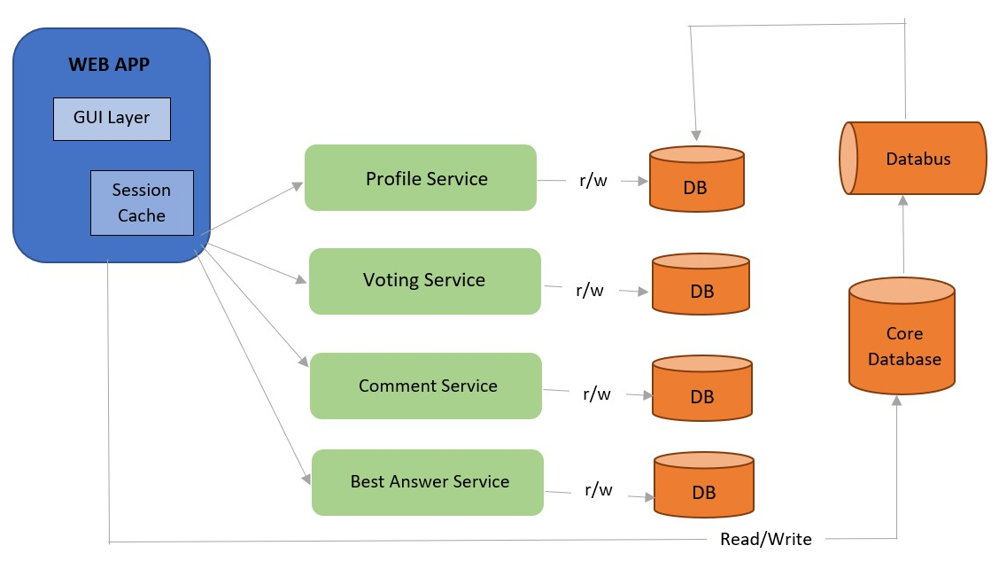

# soen341project
## Description
This repository contains a project for SOEN 341.  
The purpose of this project is to create a website that has similar features to StackOverflow and similar websites.  
## Objective
The main objective of the project is to implement the following core features for the website.  
### Core features
- Asking and answering questions
- Voting on the answers
- Accepting the best answer

## Languages and Techniques
The languages used in this project will be:  
- PHP  
- CSS  
- SQL  
- HTML   
- Bootstrap  
- JS  

## Architecture

